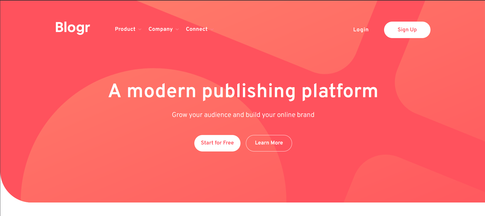

# Frontend Mentor - Blogr landing page solution

This is a solution to the [Blogr landing page challenge on Frontend Mentor](https://www.frontendmentor.io/challenges/blogr-landing-page-EX2RLAApP). Frontend Mentor challenges help you improve your coding skills by building realistic projects.


## Table of contents

- [Overview](#overview)
  - [The challenge](#the-challenge)
  - [Screenshot](#screenshot)
  - [Links](#links)
- [My process](#my-process)
  - [Built with](#built-with)
  - [What I learned](#what-i-learned)
- [Author](#author)


## Overview

### The challenge

Users should be able to:

- View the optimal layout for the site depending on their device's screen size 
- See hover states for all interactive elements on the page

### Screenshot




### Links

- Solution URL: [Github Repository](https://github.com/uvdevelop26/blogr-landing-page)
- Live Site URL: [Github Pages](https://uvdevelop26.github.io/blogr-landing-page/)

## My process

### Built with

- Semantic HTML5 markup
- SASS (CSS preprocessor)
- CSS custom properties
- Flexbox
- Mobile-first workflow

### What I learned

Insteresting way of handling media queries in SASS 
```CSS
@mixin md {
  @media (min-width: map-get($breakpoints, "md")) {
    @content;
  }
}
```

## Author

- [Porfolio Web](https://porfolio-uvbusiness.netlify.app/)
- Frontend Mentor - [@uvdevelop26](https://www.frontendmentor.io/profile/uvdevelop26)
- Instagram - [@uvbusiness24](https://www.instagram.com/uvbusiness24/)


